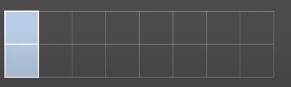
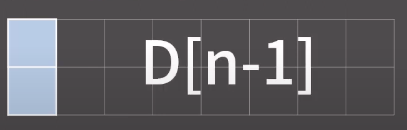

# BOJ 11726번: 2xn 타일링

<br>
<br>

## 문제 풀이 방식

<br>

### 1. 테이블 정의하기
- D[i] = 2xi 크기의 직사각형을 채우는 방법의 수
 
<br>

### 2. 점화식 찾기
- 다른 것 보다도 가장 왼쪽 위의 칸에 집중해서 생각해 보자.
- 가장 왼쪽 위의 칸은 1x2 타일로 덮히거나 2x1 타일로 덮혀야 한다.
- 2x1 타일로 덮는다면 다음과 같다.


- 2x1 타일로 덮고 나면 남은건 2xn-1 칸이 남는다.
- 이것을 채우는 방법의 수는 D[n-1]이다.


- 가장 왼쪽 위의 칸을 2x1 타일로 덮는 경우의 수는 D[n-1]이라는 것을 알 수 있다.  

- 1x2 타일로 덮는다면 다음과 같다.


- 1x2 타일을 덮을 때는 위와 같이 두 개를 겹쳐서 덮을 수 밖에 없다.
- 남은 건 2xn-2 칸이기 때문에 채우는 방법의 수는 D[n-2]가 된다.

- D[n] = D[n-1] + D[n-2]

<br>

### 3. 초기값 정의하기

- D[1] = 1
- D[2] = 2
- D[n]을 구할 때 D[n-1], D[n-2]가 필요하기 때문에


<br>

### 4. 로직 구현

- 문제에서 "방법의 수를 10,007로 나눈 나머지를 출력한다." 라는 부분이 있다.
- mod라는 상수에 값을 넣어 놓고 나누어준다.
- 다만 주의할 점은 출력하기 전에(println) 이 값을 나누어 주는 것이 아닌 for문이 돌아가는 동시에 값을 계산해 주어야 한다.
- 그렇지 않다면 계산 도중에 int overflow가 발생할 수 있기 때문이다.

```java
          //초기값 정의
        dp[1] = 1;
        dp[2] = 2;

        for(int i = 3; i <= n; i++) {

            dp[i] = (dp[i-1]+dp[i-2]) % mod;
        }

        System.out.println(dp[n]);
```

<br>
<br>

## links
---
### 출처
- https://www.youtube.com/watch?v=5leTtB3PQu0&t=58s&ab_channel=BaaarkingDog

<br>

### 전체 소스코드
- https://github.com/Hambak-note/coding-test-practice/blob/main/codes/src/baekjoon/dp/BOJ_11726.java