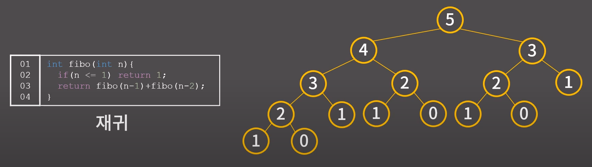
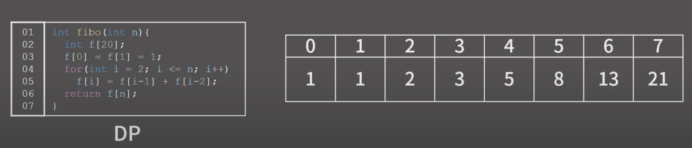

# 다이나믹 프로그래밍(Dynamic Programing ,DP)

 
 

## 1. 알고리즘 설명

 

### 다이나믹 프로그래밍

- 여러 개의 하위 문제를 먼저 푼 후 그 결과를 쌓아오려 주어진 문제를 해결하는 알고리즘
- 문제를 해결하기 위한 점화식을 찾아낸 후 점화식의 항을 밑에서부터 차례로 구해나가서 답을 알아내는 형태의 알고리즘
- 예시: 피보나치 문제

    - 피보나치 수열의 N번째 항을 재귀적으로 구하면 중복된 연산이 계속 발생해서 O(1.618^N)의 시간이 걸림

 

- 피보나치 문제를 DP로 해결하면 아래와 같이 미리 배열을 만들어두고 0번째 인덱스부터 하나씩 채워가는 방식으로 해결 가능

  - N+1번째 칸을 채우고 나면 답을 알 수 있기 때문에 O(N)에 답을 알아낼 수 있다.
  - 중간 결과를 저장해서 이용하는지 그렇지 않은지에 따라 극적인 시간복잡도의 차이가 발생

 
 

### DP를 푸는 과정

1. 테이블 정의하기
2. 점화식 찾기
3. 초기값 정하기

- 다양한 DP 문제를 풀어봤거나 뛰어난 수학적 직관력을 가지고 있지 않은 이상 문제에서 점화식을 이끌어내는 과정은 쉽지않다. 
- 초보 단계에서는 주어진 문제가 DP로 푸는 문제라는 것 자체를 알아차리지 못할 수도 있다.

 
 
참고: https://www.youtube.com/watch?v=5leTtB3PQu0&t=58s&ab_channel=BaaarkingDog